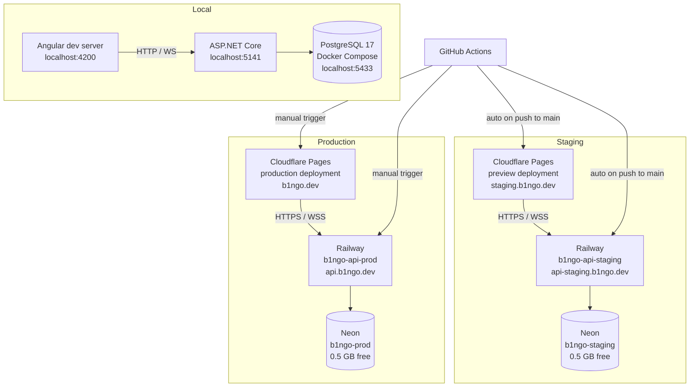
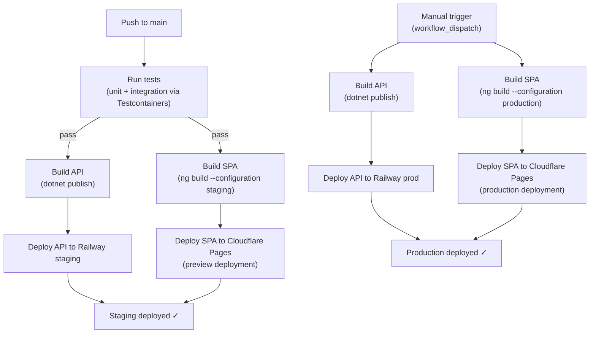

# 0010. Deployment Architecture

**Status:** proposed
**Date:** 2026-03-17
**Deciders:** Software Architect, Product Owner

## Context

B1ngo needs a deployment pipeline that supports three environments (local, staging, production) with trunk-based development on a single `main` branch. The project is a monorepo with an ASP.NET Core API (`server/`), an Angular SPA (`client/`), and PostgreSQL for persistence.

The team is small, budget is near-zero, and the system has no users yet. The deployment architecture must be cheap to start, simple to operate, and possible to evolve when the project outgrows free tiers.

Hosting decisions have already been made by the Product Owner:

| Component | Host | Tier |
|---|---|---|
| SPA | Cloudflare Pages | Free |
| API | Railway | Free trial → $5/month hobby |
| Database | Neon | Free (0.5 GB, two projects) |

This ADR documents **how** these services are wired together, not whether they are the right choices.

## Decision

### Deployment Topology

Three environments, each mapped to specific service instances:

| Environment | SPA | API | Database |
|---|---|---|---|
| **Local** | `ng serve` (localhost:4200) | `dotnet run` (localhost:5141) | Docker Compose postgres:17 (localhost:5433) |
| **Staging** | Cloudflare Pages preview deployment | Railway service `b1ngo-api-staging` | Neon project `b1ngo-staging` |
| **Production** | Cloudflare Pages production deployment | Railway service `b1ngo-api-prod` | Neon project `b1ngo-prod` |



### Why This Split

- **SPA on Cloudflare Pages**: The Angular app compiles to static files. Cloudflare Pages serves static assets from its global CDN with zero cold starts, automatic HTTPS, and a generous free tier (unlimited bandwidth). No server-side rendering is needed.
- **API on Railway**: The ASP.NET Core API is a long-running process that needs WebSocket support (SignalR) and environment variable injection. Railway provides container-based hosting with native .NET support via Dockerfile, built-in WebSocket proxying, and per-service environment variables. The free trial covers initial development; hobby tier ($5/month) is the cheapest option that avoids execution time limits.
- **Database on Neon**: Neon provides serverless PostgreSQL 17 with connection pooling, branching, and a free tier (0.5 GB storage, two projects). Two separate Neon projects cleanly isolate staging and production data. Neon's connection pooler reduces connection overhead from Railway's container-based hosting.

### Environment Configuration

#### ASPNETCORE_ENVIRONMENT

| Environment | Value | Set Via |
|---|---|---|
| Local | `Development` | `launchSettings.json` / `docker-compose.yml` |
| Staging | `Staging` | Railway environment variable |
| Production | `Production` | Railway environment variable |

The API uses `ASPNETCORE_ENVIRONMENT` to control:
- Whether Scalar API docs are exposed (Development only — see `WebApplicationExtensions.cs:19`)
- Whether auto-migration runs (Development only — see `WebApplicationExtensions.cs:30-33`)
- Configuration file selection (`appsettings.{Environment}.json`)

#### Connection Strings

Connection strings are injected via the `ConnectionStrings__Database` environment variable on Railway. They are **never** committed to source control.

| Environment | Source |
|---|---|
| Local | `appsettings.Development.json` (localhost:5433, already committed — local-only credentials) |
| Staging | Railway env var → Neon `b1ngo-staging` pooled connection string |
| Production | Railway env var → Neon `b1ngo-prod` pooled connection string |

Neon connection strings use the format:
```
Host=ep-xxxx.us-east-2.aws.neon.tech;Port=5432;Database=b1ngo;Username=b1ngo_owner;Password=<password>;SSL Mode=Require
```

Always use the **pooled** connection string (port 5432 through Neon's PgBouncer) to avoid exhausting Neon's free-tier connection limit (20 connections).

#### CORS Origins

CORS is not yet configured in the application (no `AddCors` call exists). When implementing CORS, configure per-environment allowed origins:

| Environment | Allowed Origin |
|---|---|
| Local | `http://localhost:4200` |
| Staging | `https://staging.b1ngo.dev` |
| Production | `https://b1ngo.dev` |

Inject via an environment variable (`AllowedOrigins`) on Railway, parsed as a semicolon-separated list. Do not hardcode origins.

#### SignalR / WebSocket Considerations

The API uses SignalR with a WebSocket transport (`/hubs/game` — see `WebApplicationExtensions.cs:37`). Key considerations:

- **Railway**: Supports WebSocket connections natively. No special configuration needed. Railway's proxy automatically upgrades HTTP connections to WebSocket when the `Upgrade: websocket` header is present.
- **Cloudflare**: When the SPA is served via Cloudflare Pages, WebSocket connections from the browser go directly to the API domain (`api.b1ngo.dev` or `api-staging.b1ngo.dev`), not through the Cloudflare Pages domain. Cloudflare does **not** proxy WebSocket traffic for Pages projects — this is expected and correct because the WebSocket endpoint lives on the API, not the SPA.
- **SSL**: Both staging and production must use `wss://` (WebSocket Secure). Railway provides automatic HTTPS/WSS on custom domains and on `*.up.railway.app` domains.
- **Sticky sessions**: SignalR's default WebSocket transport does not require sticky sessions. If long-polling fallback is ever needed, Railway's single-instance deployment handles it naturally (only one instance exists).

### CI/CD Pipeline Design

Trunk-based development: all work merges to `main`. No long-lived branches.



#### Staging Pipeline (automatic, on push to `main`)

1. **Test**: Run all unit tests and integration tests. Integration tests use Testcontainers (already configured in `B1ngoApiFactory.cs`) — they spin up a PostgreSQL container in CI, not against staging infrastructure.
2. **Build API**: `dotnet publish` the `B1ngo.Web` project in Release configuration.
3. **Build SPA**: `ng build --configuration staging` in the `client/ui/` directory.
4. **Deploy API**: Push to Railway's `b1ngo-api-staging` service via Railway CLI or GitHub integration.
5. **Deploy SPA**: Deploy to Cloudflare Pages via Wrangler CLI. Preview deployments are automatic if using Cloudflare's GitHub integration; otherwise use `wrangler pages deploy`.

#### Production Pipeline (manual, workflow_dispatch)

1. **Build API**: `dotnet publish` in Release configuration (tests already passed on the staging deploy).
2. **Build SPA**: `ng build --configuration production`.
3. **Deploy API**: Push to Railway's `b1ngo-api-prod` service.
4. **Deploy SPA**: Deploy to Cloudflare Pages production deployment.

Production does **not** re-run tests. The code being promoted is the same commit that passed tests on the staging pipeline. Re-running tests would add CI time without safety (same code, same commit SHA).

#### Workflow Files

Two GitHub Actions workflow files:

| File | Trigger | Purpose |
|---|---|---|
| `.github/workflows/deploy-staging.yml` | `push` to `main` | Test → Build → Deploy to staging |
| `.github/workflows/deploy-production.yml` | `workflow_dispatch` | Build → Deploy to production |

### Database Migration Strategy

**Current state**: `MigrateAsync()` runs on startup, guarded by `IsDevelopment()` (see `WebApplicationExtensions.cs:30-33`). This means staging and production do **not** auto-migrate.

**Recommendation: Run migrations as a separate CI step before deploying the API.**

Migrations should be a dedicated job in the GitHub Actions workflow, executed **after** tests pass and **before** the API deployment:

```
Tests pass → Run migrations against target DB → Deploy API
```

Implementation approach:
1. Use `dotnet ef database update` with the connection string injected from GitHub Actions secrets.
2. Run as a separate job in the workflow, targeting the appropriate Neon database (staging or production).
3. Keep the `IsDevelopment()` guard on `MigrateAsync()` for local development convenience.

**Why not auto-migrate on startup in staging/prod?**

- **Cold start coupling**: Railway may restart the container for scaling or health checks. Migrations running on every startup adds latency and risks partial migrations on timeout.
- **Visibility**: A CI step produces a clear log of what migrations ran, visible in the GitHub Actions run. Startup migrations are buried in application logs.
- **Rollback clarity**: If a migration fails in CI, the deployment is aborted. If it fails on startup, the container crash-loops.
- **Multiple instances**: If the API ever scales to multiple instances, concurrent `MigrateAsync()` calls create race conditions. A CI step runs exactly once.

**Migration rollback**: EF Core does not generate "down" migrations by default. For rollback, generate an explicit migration that reverses the schema change, or use Neon's point-in-time restore (branching) to recover data. Document each migration's rollback strategy in the migration file comments.

### Custom Domain Plan

Assume the domain `b1ngo.dev` is registered (or will be) and DNS is managed by Cloudflare.

| Subdomain | Service | DNS Record | SSL |
|---|---|---|---|
| `b1ngo.dev` | Cloudflare Pages (production SPA) | CNAME → Cloudflare Pages | Cloudflare (automatic) |
| `staging.b1ngo.dev` | Cloudflare Pages (staging SPA) | CNAME → Cloudflare Pages | Cloudflare (automatic) |
| `api.b1ngo.dev` | Railway (production API) | CNAME → Railway custom domain | Railway (automatic via Let's Encrypt) |
| `api-staging.b1ngo.dev` | Railway (staging API) | CNAME → Railway custom domain | Railway (automatic via Let's Encrypt) |

**DNS configuration approach**:
1. Register domain and add it to Cloudflare (free plan).
2. Cloudflare Pages automatically provisions `b1ngo.dev` and `staging.b1ngo.dev` when custom domains are added in the Pages project settings.
3. For Railway API domains, add a CNAME record in Cloudflare DNS pointing to the Railway-provided domain. Set Cloudflare proxy to **DNS only** (gray cloud) for API subdomains — Railway handles its own TLS, and Cloudflare proxying would interfere with WebSocket upgrade headers.
4. Railway automatically provisions Let's Encrypt certificates for custom domains.

**Important**: Cloudflare proxy (orange cloud) must be **disabled** for `api.b1ngo.dev` and `api-staging.b1ngo.dev`. Enabling Cloudflare proxy on API subdomains would double-proxy the traffic and can cause issues with WebSocket connections and Railway's health checks.

### Secrets Management

#### Secrets Inventory

| Secret | Used By | Description |
|---|---|---|
| `NEON_STAGING_CONNECTION_STRING` | GitHub Actions → Railway staging | Neon pooled connection string for staging DB |
| `NEON_PROD_CONNECTION_STRING` | GitHub Actions → Railway prod | Neon pooled connection string for production DB |
| `RAILWAY_TOKEN` | GitHub Actions | Railway API token for deployments |
| `CLOUDFLARE_API_TOKEN` | GitHub Actions | Cloudflare API token for Pages deployments |
| `CLOUDFLARE_ACCOUNT_ID` | GitHub Actions | Cloudflare account ID for Wrangler CLI |

#### Where Secrets Are Stored

- **GitHub Actions secrets**: All secrets above are stored as repository secrets in GitHub. They are injected into workflow steps as environment variables.
- **Railway environment variables**: Connection strings and `ASPNETCORE_ENVIRONMENT` are set directly on each Railway service. These are **not** in GitHub secrets — they are configured once in Railway's dashboard and persist across deployments.
- **Neon dashboard**: Connection strings are generated by Neon when the project is created. Copy them to both GitHub Actions secrets (for CI migrations) and Railway environment variables (for runtime).

#### Injection Flow

```
GitHub Actions secrets
  ├── RAILWAY_TOKEN → used by Railway CLI to authenticate deployments
  ├── CLOUDFLARE_API_TOKEN → used by Wrangler CLI to deploy Pages
  ├── CLOUDFLARE_ACCOUNT_ID → used by Wrangler CLI
  ├── NEON_STAGING_CONNECTION_STRING → used by `dotnet ef database update` in staging workflow
  └── NEON_PROD_CONNECTION_STRING → used by `dotnet ef database update` in production workflow

Railway environment variables (set in Railway dashboard, not in GitHub)
  ├── ConnectionStrings__Database → Neon connection string
  ├── ASPNETCORE_ENVIRONMENT → Staging or Production
  └── AllowedOrigins → CORS allowed origins
```

## Alternatives Considered

### Single Railway Service with Two Environments (instead of Two Services)

Railway supports environment-based configuration on a single service. Rejected because:
- Two services provide complete isolation — a staging deployment cannot affect production availability.
- Each service gets its own Railway domain, making custom domain mapping cleaner.
- Cost is identical (Railway charges per resource usage, not per service count).

### Neon Branching (instead of Two Separate Projects)

Neon's branching feature creates copy-on-write database branches from a parent. Rejected because:
- Staging and production should have **independent** data lifecycles. Branching creates a parent-child relationship that adds conceptual overhead.
- Two separate projects are simpler to reason about and match the free tier (two projects allowed).
- Branching is valuable for preview environments (per-PR databases) — but that's not needed for trunk-based development with only staging and production.

### Auto-Migration on Startup (instead of CI Step)

Keep `MigrateAsync()` running on startup for all environments. Rejected because of cold-start coupling, crash-loop risk on migration failure, and race conditions with multiple instances. See "Database Migration Strategy" section for full rationale.

### Vercel for SPA (instead of Cloudflare Pages)

Vercel offers similar static hosting with a generous free tier. Not considered because the PO has already selected Cloudflare Pages. Both are viable; the choice has minimal architectural impact since the SPA is purely static.

## Consequences

### Positive

- **Zero cost to start**: All three services have free tiers sufficient for development and early users.
- **Real deployment pipeline from day one**: Staging and production environments with automated CI/CD, not manual `dotnet publish` uploads.
- **Trunk-based flow**: Push to `main` → staging. Manual promote → production. No environment branches, no merge conflicts between environment configs.
- **Clear separation of concerns**: Static SPA on a CDN (fast, global), dynamic API on a container host (flexible, WebSocket-capable), managed database (zero ops).
- **Independent scaling path**: Each component can be upgraded independently — Cloudflare Pages Pro, Railway Pro, Neon Pro — without architectural changes.

### Negative

- **Railway cold starts**: On the free/hobby tier, Railway may sleep inactive services. The first request after sleep incurs a cold start (several seconds for .NET). Mitigation: Railway hobby tier ($5/month) keeps the service awake; alternatively, configure a health check ping from an external uptime monitor.
- **Neon 0.5 GB limit**: The free tier limits storage to 0.5 GB per project. For a bingo game with transient rooms, this is likely sufficient for months. Mitigation: monitor storage usage; Neon's paid tier starts at $19/month for 10 GB.
- **Neon connection limits**: Free tier allows 20 concurrent connections. With a single Railway instance and connection pooling, this is adequate. Mitigation: use Neon's pooled connection string (PgBouncer); if limits are hit, scale to Neon paid tier.
- **Vendor lock-in**: Railway and Neon are smaller vendors. If either shuts down or changes pricing, migration is required. Mitigation: the API is a standard .NET container (runs anywhere Docker runs); the database is standard PostgreSQL (runs anywhere Postgres runs). Only deployment scripts and connection strings change.
- **Three dashboards**: Logs and monitoring are split across Cloudflare, Railway, and Neon. No unified observability. Mitigation: acceptable for a small project; add centralized logging (e.g., Seq, Datadog) if the team grows.

### Evolution Path

| Trigger | Action |
|---|---|
| Neon storage exceeds 0.5 GB | Upgrade to Neon Launch ($19/month) or migrate to Railway-hosted PostgreSQL |
| Railway cold starts are unacceptable | Upgrade to Railway Pro ($20/month) for always-on instances |
| Need preview environments per PR | Use Neon branching + Cloudflare Pages preview URLs + Railway PR environments |
| Need custom auth | Add an Identity context; consider Cloudflare Access for staging gate |
| Traffic exceeds hobby tier limits | Railway Pro + Neon Scale; Cloudflare Pages free tier has no practical traffic limit |
