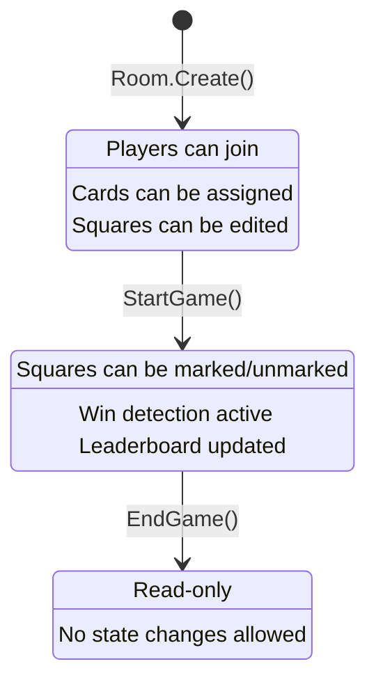
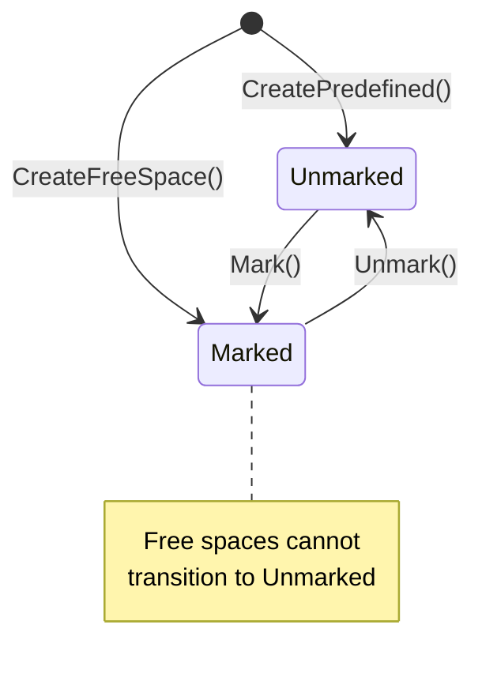

# Domain Model

## Ubiquitous Language

| Term | Definition | Code Location |
|---|---|---|
| **Room** | A game session where players compete. Tied to a specific F1 session. Has a lifecycle: Lobby → Active → Completed. | `Room.cs` |
| **Player** | A participant in a Room. Has a display name, an optional bingo card, and a win state. | `Player.cs` |
| **Host** | The Player who created the Room. Identified by `Room.HostPlayerId`. | `Room.cs:16` |
| **Bingo Card** | A grid of squares assigned to a Player. Size is configurable (3x3 to 9x9, odd only). Has a center free space. | `BingoCard.cs` |
| **Bingo Square** | A single cell on a bingo card. Can be predefined (with an event key for auto-marking) or custom (player-edited). | `BingoSquare.cs` |
| **Free Space** | The center square of a card. Always marked. Cannot be edited or unmarked. | `BingoSquare.cs:37-38` |
| **Event Key** | A string identifier linking a predefined square to an F1 event (e.g., `"SAFETY_CAR"`). Cleared when a player edits the square text. | `BingoSquare.cs:8` |
| **Join Code** | A 6-character alphanumeric code (no ambiguous characters: no `0`, `O`, `I`, `1`) derived from the Room's ID. Used to join a Room. | `Room.cs:8-9` |
| **Race Session** | The F1 session context for a Room: season year, Grand Prix name, session type (FP1-3, Qualifying, Sprint, Race, etc.). | `RaceSession.cs` |
| **Room Configuration** | Game settings: matrix size and which win patterns are active. Defaults to 5x5 with Row/Column/Diagonal. | `RoomConfiguration.cs` |
| **Win Pattern** | A pattern of marked squares that constitutes a win: Row, Column, Diagonal, or Blackout. | `WinPatternType.cs` |
| **Leaderboard** | Ordered list of players who have achieved bingo, ranked by completion time. | `LeaderboardEntry.cs` |
| **Marked By** | Who marked a square: `Player` (manual), `Host` (host override), or `Api` (automated via event feed). | `SquareMarkedBy.cs` |

## Aggregate Boundaries

```mermaid
graph TB
    subgraph "Room Aggregate"
        ROOM["Room<br/><i>Aggregate Root</i>"]
        PLAYER["Player<br/><i>Entity</i>"]
        CARD["BingoCard<br/><i>Value Object</i>"]
        SQUARE["BingoSquare<br/><i>Value Object</i>"]
        SESSION["RaceSession<br/><i>Value Object</i>"]
        CONFIG["RoomConfiguration<br/><i>Value Object</i>"]
        LB["LeaderboardEntry<br/><i>Value Object</i>"]

        ROOM -->|1..1| SESSION
        ROOM -->|1..1| CONFIG
        ROOM -->|1..*| PLAYER
        ROOM -->|0..*| LB
        PLAYER -->|0..1| CARD
        CARD -->|N*N| SQUARE
    end

    style ROOM fill:#2d5a27,stroke:#4a8f40
    style PLAYER fill:#1a4a6e,stroke:#3a8abd
    style CARD fill:#6e4a1a,stroke:#bd8a3a
    style SQUARE fill:#6e4a1a,stroke:#bd8a3a
    style SESSION fill:#6e4a1a,stroke:#bd8a3a
    style CONFIG fill:#6e4a1a,stroke:#bd8a3a
    style LB fill:#6e4a1a,stroke:#bd8a3a
```

**Why one aggregate?** All invariants span multiple entities. Starting a game requires checking every Player's Card. Marking a square requires checking Room status, Player win state, and Card contents. Leaderboard management requires Room-level coordination. See [ADR-0001](adrs/0001-room-as-sole-aggregate-root.md).

**Why Player is an entity, not a value object.** Players have identity (PlayerId) that persists across operations. A Player is referenced by the leaderboard, by the host designation, and by API responses. Replacing a Player (as you would a value object) would break these references.

**Why BingoCard and BingoSquare are value objects (structurally).** They have no independent identity. A Card belongs to exactly one Player. A Square belongs to exactly one Card. They are not referenced by ID from outside their parent. They are currently implemented as classes (not records) because they carry mutable state — this is a known modeling tension (see audit finding F1).

## Invariants

### Room Lifecycle

| # | Invariant | Enforced By | Location |
|---|---|---|---|
| R1 | Room is created in `Lobby` status | `Room.Create` constructor logic | `Room.cs:28` |
| R2 | Players can only join when status is `Lobby` | `Room.AddPlayer` → `EnsureStatus` | `Room.cs:54` |
| R3 | Game can only start when status is `Lobby` | `Room.StartGame` → `EnsureStatus` | `Room.cs:72` |
| R4 | Game can only start when all Players have Cards | `Room.StartGame` → null check loop | `Room.cs:74-81` |
| R5 | Game can only end when status is `Active` | `Room.EndGame` → `EnsureStatus` | `Room.cs:89` |
| R6 | Squares can only be marked when status is `Active` | `Room.MarkSquare` → `EnsureStatus` | `Room.cs:97` |
| R7 | Squares can only be unmarked when status is `Active` | `Room.UnmarkSquare` → `EnsureStatus` | `Room.cs:127` |
| R8 | Squares can only be edited when status is `Lobby` | `Room.EditSquare` → `EnsureStatus` | `Room.cs:151` |

### Player

| # | Invariant | Enforced By | Location |
|---|---|---|---|
| P1 | Display name cannot be null/empty/whitespace | `Player.Create` → `ArgumentException.ThrowIfNullOrWhiteSpace` | `Player.cs:20` |
| P2 | No duplicate display names (case-insensitive) in a Room | `Room.AddPlayer` → `HasPlayerWithDisplayName` | `Room.cs:57-61` |
| P3 | A Player can only have one Card assigned | `Player.AssignCard` → null check | `Player.cs:28-31` |
| P4 | A Player who has won cannot mark more squares | `Room.MarkSquare` → `player.HasWon` check | `Room.cs:101-104` |

### BingoCard

| # | Invariant | Enforced By | Location |
|---|---|---|---|
| C1 | Matrix size ≥ 3 | `BingoCard` constructor | `BingoCard.cs:17` |
| C2 | Square count = matrixSize² | `BingoCard` constructor | `BingoCard.cs:19-24` |

### BingoSquare

| # | Invariant | Enforced By | Location |
|---|---|---|---|
| S1 | Free space is always marked | `BingoSquare` constructor | `BingoSquare.cs:24-27` |
| S2 | Cannot mark a free space | `BingoSquare.Mark` guard | `BingoSquare.cs:42-45` |
| S3 | Cannot double-mark a square | `BingoSquare.Mark` guard | `BingoSquare.cs:47-50` |
| S4 | API can only auto-mark predefined squares (with EventKey) | `BingoSquare.Mark` guard | `BingoSquare.cs:52-55` |
| S5 | Cannot unmark a free space | `BingoSquare.Unmark` guard | `BingoSquare.cs:63-66` |
| S6 | Cannot unmark an unmarked square | `BingoSquare.Unmark` guard | `BingoSquare.cs:68-71` |
| S7 | Cannot edit a free space | `BingoSquare.Edit` guard | `BingoSquare.cs:80-83` |
| S8 | Editing clears the EventKey (square becomes custom) | `BingoSquare.Edit` | `BingoSquare.cs:89` |

### RoomConfiguration

| # | Invariant | Enforced By | Location |
|---|---|---|---|
| CF1 | Matrix size between 3 and 9 | Constructor guards | `RoomConfiguration.cs:15-16` |
| CF2 | Matrix size must be odd (center free space) | Constructor guard | `RoomConfiguration.cs:18-21` |
| CF3 | At least one winning pattern required | Constructor guard | `RoomConfiguration.cs:23-26` |

### RaceSession

| # | Invariant | Enforced By | Location |
|---|---|---|---|
| RS1 | Season ≥ 1950 | Constructor guard | `RaceSession.cs:11` |
| RS2 | Grand Prix name cannot be null/empty/whitespace | Constructor guard | `RaceSession.cs:12` |

### Leaderboard

| # | Invariant | Enforced By | Location |
|---|---|---|---|
| L1 | Ranks are sequential (1, 2, 3, ...) | `Room.RemoveFromLeaderboard` re-ranks | `Room.cs:189-197` |
| L2 | A win revocation removes the entry and re-ranks | `Room.UnmarkSquare` | `Room.cs:139-147` |

## State Machines

### Room Lifecycle

**Allowed operations by state:**

| Operation | Lobby | Active | Completed |
|---|---|---|---|
| `AddPlayer` | Yes | No | No |
| `StartGame` | Yes (if all have cards) | No | No |
| `EndGame` | No | Yes | No |
| `MarkSquare` | No | Yes | No |
| `UnmarkSquare` | No | Yes | No |
| `EditSquare` | Yes | No | No |
| `AssignCard` | Yes (via Player) | - | - |

### BingoSquare Lifecycle

## Domain Events

| Event | Payload | Raised When | Semantic |
|---|---|---|---|
| `RoomCreatedDomainEvent` | `RoomId`, `JoinCode` | `Room.Create()` | A new game room exists and can accept players |
| `PlayerJoinedRoomDomainEvent` | `RoomId`, `PlayerId`, `DisplayName` | `Room.Create()`, `Room.AddPlayer()` | A player (including the host) has entered the room |
| `GameStartedDomainEvent` | `RoomId` | `Room.StartGame()` | The game is now active; squares can be marked |
| `GameCompletedDomainEvent` | `RoomId` | `Room.EndGame()` | The game is over; no further state changes |
| `SquareMarkedDomainEvent` | `RoomId`, `PlayerId`, `Row`, `Column`, `MarkedBy` | `Room.MarkSquare()` | A specific square has been marked on a player's card |
| `SquareUnmarkedDomainEvent` | `RoomId`, `PlayerId`, `Row`, `Column` | `Room.UnmarkSquare()` | A previously marked square has been unmarked |
| `BingoAchievedDomainEvent` | `RoomId`, `PlayerId`, `Pattern`, `Rank` | `Room.MarkSquare()` | A player has completed a winning pattern and been ranked |

All events implement `IDomainEvent` with an `OccurredAt` timestamp. Events are immutable records. Dispatch occurs post-persistence (see [ADR-0004](adrs/0004-domain-event-dispatch-post-persistence.md)).
