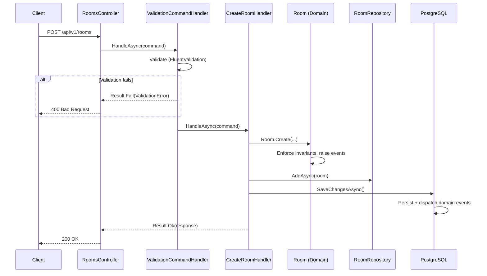

# System Design

## System Overview

B1ngo is a multiplayer bingo game played during Formula 1 sessions. A host creates a room tied to a specific F1 session (e.g., 2026 Bahrain Grand Prix — Race), shares a join code, and players join. Each player gets a bingo card with F1 event predictions. During the session, squares are marked as events occur. The first player to complete a winning pattern (row, column, diagonal, or blackout) wins.

The system is a monolithic web application: ASP.NET Core API backend, Angular frontend, PostgreSQL database.

## Architecture Diagram

```mermaid
graph TB
    subgraph "API Layer"
        WEB["B1ngo.Web<br/><i>ASP.NET Core</i><br/>Controllers, composition root"]
    end

    subgraph "Application Layer"
        APP_F["B1ngo.Application.Features<br/>Command handlers, validators"]
        APP_C["B1ngo.Application.Common<br/>ICommand, ICommandHandler,<br/>Result&lt;T&gt;, Error"]
    end

    subgraph "Domain Layer"
        DOM_G["B1ngo.Domain.Game<br/>Room, Player, BingoCard,<br/>BingoSquare, domain events"]
        DOM_C["B1ngo.Domain.Core<br/>Entity, EntityId, IRepository,<br/>IUnitOfWork, IDomainEvent"]
    end

    subgraph "Infrastructure Layer"
        INF_P["B1ngo.Infrastructure.Postgresql<br/>DbContext, migrations,<br/>repositories, UnitOfWork"]
        INF_C["B1ngo.Infrastructure.Core<br/>Base Repository, EventDispatcher,<br/>EF conventions"]
    end

    subgraph "Storage"
        DB[(PostgreSQL 17)]
    end

    subgraph "Client"
        UI["Angular 21 SPA<br/><i>Tailwind CSS</i>"]
    end

    UI -->|HTTP| WEB
    WEB --> APP_F
    APP_F --> APP_C
    APP_F --> DOM_G
    DOM_G --> DOM_C
    INF_P --> INF_C
    INF_P --> DOM_G
    INF_P --> APP_C
    INF_C --> DOM_C
    WEB --> INF_P
    INF_P --> DB

    style DOM_C fill:#2d5a27,stroke:#4a8f40
    style DOM_G fill:#2d5a27,stroke:#4a8f40
    style APP_C fill:#1a4a6e,stroke:#3a8abd
    style APP_F fill:#1a4a6e,stroke:#3a8abd
    style INF_C fill:#6e4a1a,stroke:#bd8a3a
    style INF_P fill:#6e4a1a,stroke:#bd8a3a
    style WEB fill:#5a1a5a,stroke:#9a3a9a
```



**Dependency rule**: arrows point inward. Domain depends on nothing. Application depends on Domain. Infrastructure depends on Domain and Application. Web (composition root) references Application and Infrastructure.

## Bounded Contexts

One bounded context: **Game**. It owns the entire lifecycle of a bingo room — creation, player management, gameplay, and scoring.

No other contexts exist yet. Potential future contexts:

| Candidate | Trigger |
|---|---|
| **Identity** | When authentication moves beyond the current stub (`CurrentUserProvider` returns `Guid.Empty`) |
| **Event Catalog** | If F1 event definitions (what can appear on a bingo card) are managed independently of rooms |
| **Notification** | If the system sends push notifications or WebSocket events to clients |

These contexts would communicate with Game via domain events or application-level queries. No shared database access.

## Aggregate Map

| Aggregate | Root Entity | Child Entities | Value Objects | Key Invariants |
|---|---|---|---|---|
| **Room** | `Room` | `Player` | `RaceSession`, `RoomConfiguration`, `BingoCard`, `BingoSquare`, `LeaderboardEntry` | Players join only in Lobby. Game starts only when all Players have Cards. Squares marked only when Active. No duplicate display names. Leaderboard re-ranks on win revocation. |

See [Domain Model](domain-model.md) for full invariant documentation.

## Data Flow

### Write Path (Command)



### Read Path (Query)

Not yet implemented. When added, queries will bypass the domain model and read directly from the database via dedicated query handlers and DTOs.

## Domain Events

| Event | Raised By | Trigger | Consumers |
|---|---|---|---|
| `RoomCreatedDomainEvent` | `Room.Create` | Room is instantiated | None registered |
| `PlayerJoinedRoomDomainEvent` | `Room.Create`, `Room.AddPlayer` | Player is added to room | None registered |
| `GameStartedDomainEvent` | `Room.StartGame` | Room transitions Lobby → Active | None registered |
| `GameCompletedDomainEvent` | `Room.EndGame` | Room transitions Active → Completed | None registered |
| `SquareMarkedDomainEvent` | `Room.MarkSquare` | A square is marked on a player's card | None registered |
| `SquareUnmarkedDomainEvent` | `Room.UnmarkSquare` | A square is unmarked | None registered |
| `BingoAchievedDomainEvent` | `Room.MarkSquare` | A player's card matches a winning pattern | None registered |

Events are dispatched post-persistence (see [ADR-0004](adrs/0004-domain-event-dispatch-post-persistence.md)). No handlers are registered yet.

## Persistence Model

### Tables

```
rooms
├── id                  uuid        PK
├── join_code           varchar(15) UNIQUE
├── status              varchar     (enum as string)
├── host_player_id      uuid        FK → players.id
├── session_season      int
├── session_grand_prix_name varchar(100)
├── session_session_type    varchar  (enum as string)
├── configuration       jsonb       (RoomConfiguration)
├── leaderboard         jsonb       (LeaderboardEntry[])
├── created_by          uuid
├── created_at          timestamptz
├── last_modified_by    uuid
└── last_modified_at    timestamptz

players
├── id                  uuid        PK
├── room_id             uuid        FK → rooms.id (cascade delete)
├── display_name        varchar(50)
├── has_won             boolean
├── card                jsonb       (BingoCard → BingoSquare[])
├── created_by          uuid
├── created_at          timestamptz
├── last_modified_by    uuid
└── last_modified_at    timestamptz
```

### Indexes

| Table | Column(s) | Type | Purpose |
|---|---|---|---|
| `rooms` | `join_code` | Unique | Room lookup by join code |

### JSON Column Structures

**`configuration`** (on `rooms`):
```json
{
  "MatrixSize": 5,
  "WinningPatterns": ["Row", "Column", "Diagonal"]
}
```

**`card`** (on `players`):
```json
{
  "MatrixSize": 5,
  "Squares": [
    {
      "Row": 0, "Column": 0,
      "DisplayText": "Safety Car deployed",
      "EventKey": "SAFETY_CAR",
      "IsFreeSpace": false,
      "IsMarked": false,
      "MarkedBy": null,
      "MarkedAt": null
    }
  ]
}
```

## API Surface

Base URL: `/api/v{version}/`
Versioning: URL segment (`/api/v1/...`). Default version: 1.

| Method | Path | Handler | Request Body | Success | Error |
|---|---|---|---|---|---|
| `POST` | `/api/v1/rooms` | `CreateRoomHandler` | `CreateRoomCommand` | `200` → `{ roomId, joinCode }` | `400` validation, `500` unexpected |
| `POST` | `/api/v1/rooms/join` | `JoinRoomHandler` | `JoinRoomCommand` | `200` → `{ roomId, playerId, displayName }` | `400` validation, `404` room not found, `409` duplicate name |

API documentation available at `/scalar/v1` in development.

## Cross-Cutting Concerns

### Error Handling

Application layer: `Result<T>` with `Error(Code, Message)` (see [ADR-0003](adrs/0003-railway-oriented-error-handling.md)).
API layer: `Error.Code` string pattern-matched to HTTP status codes (see [ADR-0008](adrs/0008-error-type-enum-for-http-mapping.md) for proposed improvement).
Domain layer: `InvalidOperationException` for invariant violations.

### Validation

Input validation via FluentValidation. Applied as a decorator (`ValidationCommandHandler`) wrapping every command handler. Validators are auto-discovered from the Application.Features assembly.

### Audit Trail

`IAuditable` on `Entity<TId>` provides `CreatedBy`, `CreatedAt`, `LastModifiedBy`, `LastModifiedAt`. Populated automatically by `B1ngoDbContext.SetAuditFields()` on `SaveChangesAsync`. User ID sourced from `ICurrentUserProvider`.

### Authentication

Stubbed. `CurrentUserProvider` returns `Guid.Empty`. No auth middleware configured. This is an intentional deferral — the domain model is independent of auth concerns.

## Known Gaps / Planned Evolution

| Gap | Current State | Impact |
|---|---|---|
| No authentication | `CurrentUserProvider` returns `Guid.Empty` | All audit fields record empty GUID as user |
| No query handlers | Only command side of CQRS implemented | No read-optimized endpoints |
| No real-time updates | HTTP only | Players must poll for game state changes |
| `BingoSquare` mutation is public | Aggregate boundary can be bypassed | See audit finding F1 |
| `GetByIdAsync` doesn't load aggregate | Base repository uses `FindAsync` without includes | Room loaded by ID has empty Players |
| Auto-migration on startup | `MigrateAsync()` runs on every start | Must be guarded before production |
| No card assignment endpoint | `Player.AssignCard()` exists but no handler/endpoint | Cards cannot be assigned via API |
| Error mapping is string-based | `ToActionResult` parses `Error.Code` | Fragile HTTP status code selection |
| Frontend is boilerplate | Angular CLI default | No game UI |
